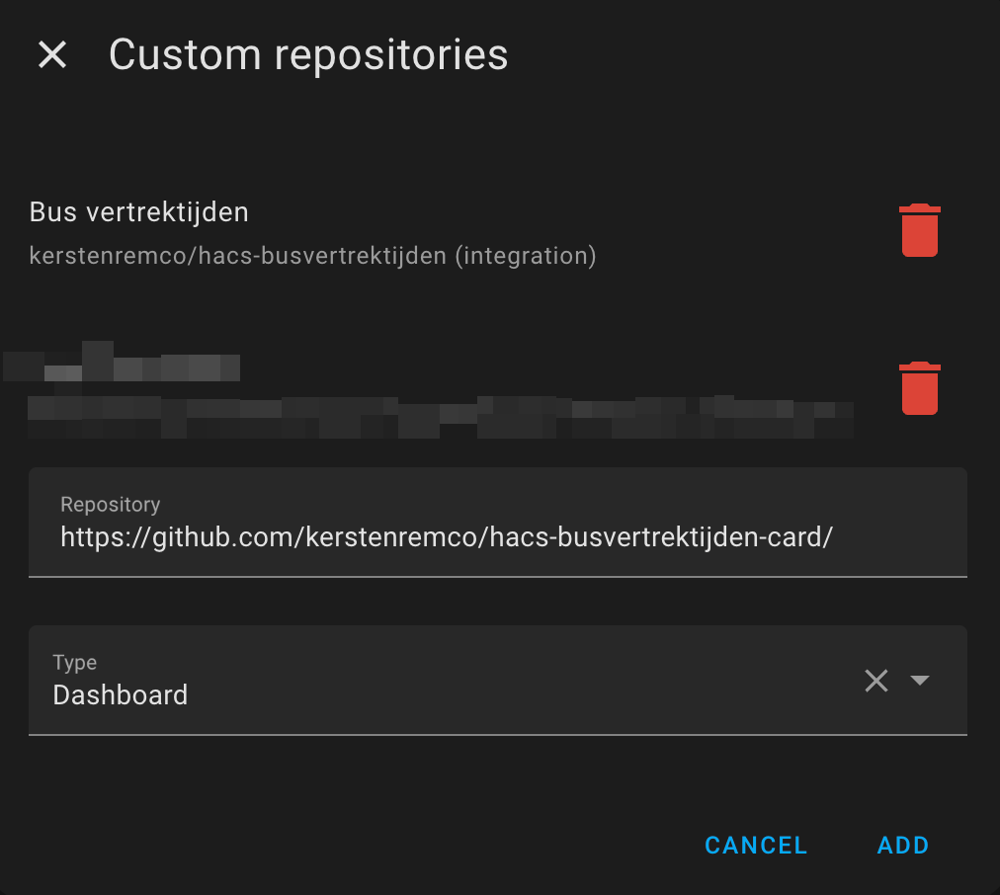
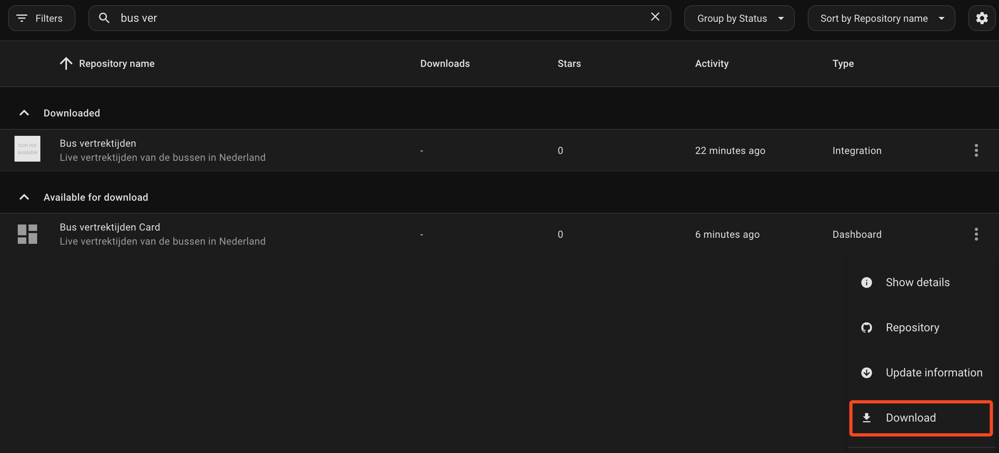
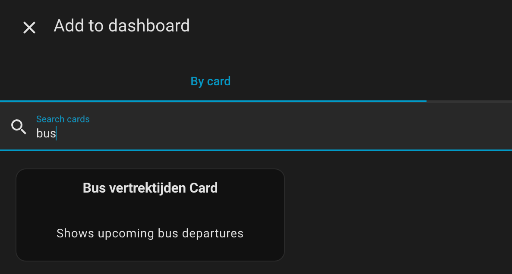
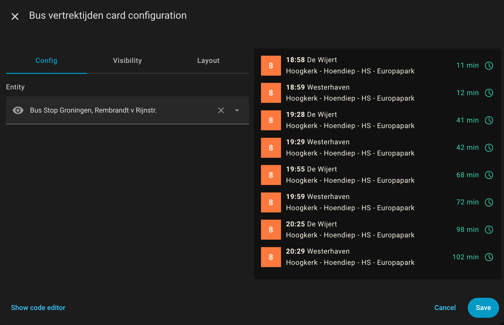

# HACS Bustijden Card

An Home Assistant Card that displays upcoming bus departures on your dashboard

> Note: This card requires the [Bus vertrektijden integration](https://github.com/kerstenremco/hacs-busvertrektijden)

> Note: This integration only works for bus stops located in the Netherlands 🇳🇱.

## Installation

- Add this repository as a **custom repository** in HACS. Type **Dashboard**
  
- Search for **Bus vertrektijden Card** and install the integration and download it.
  
- On your dashboard, add the card.
  
- Select the bus stop you want to display.
  

## Contributing

Contributions are always welcome! Open a PR when needed!
